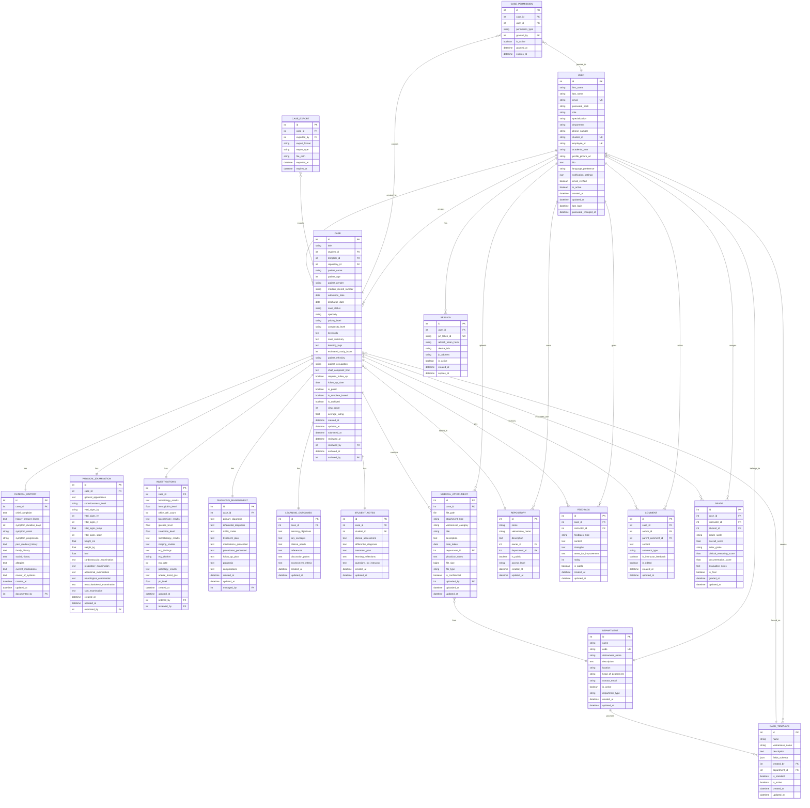
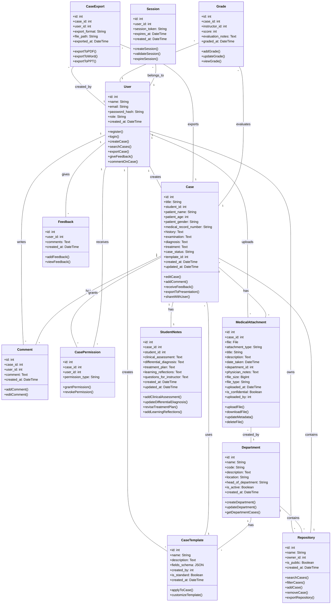

# Domain Model and CRC Cards

## Domain Model (Entities & Relationships)

### Entity Relationship Diagram (ERD)

### Class Diagram

### Entity Details
- **Attributes:**
  - id (PK)
  - name
  - email
  - password_hash
  - role (student|instructor)
  - created_at
- **Relationships:**
  - Creates Cases
  - Gives Feedback
  - Writes Comments
  - Receives CasePermissions

    ## Entity Details Table

    | Class          | Attributes                                                                                                     | Methods                                                      | Relationships                                    |
    |----------------|---------------------------------------------------------------------------------------------------------------|--------------------------------------------------------------|--------------------------------------------------|
    | User           | id, name, email, password_hash, role, created_at                                                             | register(), login(), createCase(), searchCases(), exportCase(), giveFeedback(), commentOnCase(), updateProfile() | Creates Cases, Owns Repositories, Creates Templates, Gives Feedback, Writes Comments, Receives CasePermissions, Creates Exports, Gives Grades, Has Sessions, Uploads MedicalAttachments  |
    | Case           | id, title, student_id, patient_name, patient_age, patient_gender, medical_record_number, history, examination, diagnosis, treatment, case_status, template_id, created_at, updated_at | editCase(), addComment(), receiveFeedback(), exportToPresentation(), shareWithUser(), submitForReview() | Created by User, Uses CaseTemplate, Has Comments, Grants CasePermissions, Contained in Repository, Exported as CaseExport, Receives Grades, Has MedicalAttachments |
    | CaseTemplate   | id, name, description, fields_schema, created_by, is_standard, created_at                                   | applyToCase(), customizeTemplate(), validateFields()                                                      | Created by User, Used by Cases                  |
    | Repository     | id, name, owner_id, is_public, created_at                                                                   | searchCases(), filterCases(), addCase(), removeCase(), exportRepository()                                 | Owned by User, Contains Cases                    |
    | Feedback       | id, user_id, comments, created_at                                                                            | addFeedback(), viewFeedback(), editFeedback(), deleteFeedback()                                       | Given by User                                    |
    | Comment        | id, case_id, user_id, comment, created_at                                                                   | addComment(), viewComment(), editComment(), deleteComment()                                           | Written by User, Belongs to Case                |
    | CasePermission | id, case_id, user_id, permission_type                                                                       | grantPermission(), revokePermission(), updatePermission()                                             | Granted by Case, Received by User               |
    | CaseExport     | id, case_id, user_id, export_format, file_path, exported_at                                                | exportToPDF(), exportToWord(), exportToPPT(), downloadFile()                                         | Exports Case, Created by User                   |
    | Grade          | id, case_id, instructor_id, score, evaluation_notes, graded_at                                              | addGrade(), updateGrade(), viewGrade(), calculateAverage()                                           | Evaluates Case, Given by User (Instructor)      |
    | Session        | id, user_id, session_token, expires_at, created_at                                                         | createSession(), validateSession(), expireSession(), refreshSession()                                | Belongs to User                                  |
    | MedicalAttachment | id, case_id, file, attachment_type, title, description, date_taken, department_id, physician_notes, file_size, file_type, uploaded_at, is_confidential, uploaded_by | uploadFile(), downloadFile(), updateMetadata(), deleteFile(), validateFileType() | Belongs to Case, Uploaded by User, Created by Department |
    | Department     | id, name, code, description, location, head_of_department, is_active, created_at                          | createDepartment(), updateDepartment(), getDepartmentCases(), manageMedicalAttachments()            | Has CaseTemplates, Contains Repositories, Creates MedicalAttachments |
    | StudentNotes   | id, case_id, student_id, clinical_assessment, differential_diagnosis, treatment_plan, learning_reflections, questions_for_instructor, created_at, updated_at | addClinicalAssessment(), updateDifferentialDiagnosis(), reviseTreatmentPlan(), addLearningReflections() | Belongs to Case, Created by Student |
  - Shares Cases
#### Case
  - id (PK)
  - title
  - student_id (FK to User)
  - history
  - examination
  - diagnosis
  - treatment
  - created_at
  - updated_at
  - Created by User
  - Has Comments
  - Grants CasePermissions

### Case CRC Card (Table)

| Class | Responsibilities | Collaborators | Typical Methods |
|-------|------------------|---------------|-----------------|
| Case  | Store/update patient data, track changes/history, manage comments/feedback | User, Comment, CasePermission, Feedback | editCase(), addComment(), receiveFeedback(), submitForReview(), updateStatus() |

### Case Entity Details (Table)

| Attribute      | Type      | Description                                  |
|----------------|----------|----------------------------------------------|
| id             | int      | Unique identifier for the case (Primary Key) |
| title          | String   | Title of the case                            |
| student_id     | int      | Reference to the creator (User) - Foreign Key |
| history        | Text     | Patient history                              |
| examination    | Text     | Physical examination notes                   |
| diagnosis      | Text     | Diagnosis information                        |
| treatment      | Text     | Treatment plan                               |
| created_at     | DateTime | Creation timestamp                           |
| updated_at     | DateTime | Last update timestamp                        |

| Method             | Description                                 |
|--------------------|---------------------------------------------|
| addComment()       | Add a comment to the case                   |
| receiveFeedback()  | Receive feedback from instructors           |
| submitForReview()  | Submit the case for instructor review       |
| updateStatus()     | Update the case status                      |

| Relationship       | Description                                 |
|--------------------|---------------------------------------------|
| Created by         | User                                        |
| Has                | Comments                                    |
| Grants             | CasePermissions                             |

#### Feedback
  - id (PK)
  - user_id (FK to User)
  - comments
  - created_at
- **Relationships:**
  - Given by User

#### Comment
- **Attributes:**
  - id (PK)
  - case_id (FK to Case)
  - user_id (FK to User)
  - comment
  - created_at

    ### Expanded Entity Details

    #### User
    - **Attributes:**
      - id (PK, int)
      - name (String)
      - email (String, unique)
      - password_hash (String, hashed)
      - role (String: student, instructor)
      - created_at (DateTime)
    - **Methods:**
      - register(), login(), createCase(), giveFeedback(), commentOnCase(), updateProfile(), changePassword()
    - **Relationships:**
      - Creates Cases, Gives Feedback, Writes Comments, Receives CasePermissions

    #### Case
    - **Attributes:**
      - id (PK, int)
      - title (String)
      - student_id (FK to User, int)
      - history (Text)
      - examination (Text)
      - diagnosis (Text)
      - treatment (Text)
      - created_at (DateTime)
      - updated_at (DateTime)
    - **Methods:**
      - editCase(), addComment(), receiveFeedback(), submitForReview(), updateStatus()
    - **Relationships:**
      - Created by User, Has Comments, Grants CasePermissions

    #### Feedback
    - **Attributes:**
      - id (PK, int)
      - user_id (FK to User, int)
      - comments (Text)
      - created_at (DateTime)
    - **Methods:**
      - addFeedback(), viewFeedback(), editFeedback(), deleteFeedback()
    - **Relationships:**
      - Given by User

    #### Comment
    - **Attributes:**
      - id (PK, int)
      - case_id (FK to Case, int)
      - user_id (FK to User, int)
      - comment (Text)
      - created_at (DateTime)
    - **Methods:**
      - addComment(), viewComment(), editComment(), deleteComment()
    - **Relationships:**
      - Written by User, Belongs to Case

    #### CasePermission
    - **Attributes:**
      - id (PK, int)
      - case_id (FK to Case, int)
      - user_id (FK to User, int)
      - permission_type (String: view, edit, comment)
    - **Methods:**
      - grantPermission(), revokePermission(), updatePermission()
    - **Relationships:**
      - Granted by Case, Received by User
- **Relationships:**
  - Written by User
  - Belongs to Case

#### CasePermission
- **Attributes:**
  - id (PK)
  - case_id (FK to Case)
  - user_id (FK to User)
  - permission_type (view, edit, comment)
- **Relationships:**
  - Granted by Case
  - Received by User

---

## CRC Cards

## CRC Cards Table

| Class          | Responsibilities                                                                                                 | Collaborators                    | Typical Methods                                         |
|----------------|------------------------------------------------------------------------------------------------------------------|----------------------------------|---------------------------------------------------------|
| User           | Authenticate with JWT tokens, manage role-based access (student/instructor/admin), create and collaborate on cases, upload medical attachments with validation, provide structured feedback and grading, manage case permissions and sharing | Case, Repository, CaseTemplate, Feedback, Comment, CasePermission, CaseExport, Grade, Session, MedicalAttachment | register(), authenticateJWT(), createCase(), searchCases(), exportCase(), giveFeedback(), uploadMedicalFile(), managePermissions(), trackActivity() |
| Case           | Store comprehensive patient data with structured medical sections (history, examination, investigations, diagnosis), manage medical file attachments with Vietnamese categories, track case lifecycle and submissions, support collaborative editing and version control | User, Comment, CasePermission, CaseTemplate, Repository, Feedback, CaseExport, Grade, MedicalAttachment | editCase(), addComment(), receiveFeedback(), exportToPresentation(), shareWithUser(), attachMedicalFile(), updateCaseStatus(), validateMedicalData(), trackChanges() |
| CaseTemplate   | Provide standardized case formats, ensure consistent data structure, support customization                       | User, Case                       | applyToCase(), customizeTemplate(), validateFields()    |
| Repository     | Organize/store cases, provide search/filter tools, support case discovery, enable bulk operations               | Case, User                       | searchCases(), filterCases(), addCase(), removeCase(), exportRepository() |
| Feedback       | Provide structured feedback on cases, track feedback from instructors, support collaborative learning           | User                             | addFeedback(), viewFeedback(), editFeedback(), deleteFeedback() |
| Comment        | Add/view/edit/delete comments on cases, support collaborative discussions, track author/time                    | User, Case                       | addComment(), viewComment(), editComment(), deleteComment() |
| CasePermission | Manage case access permissions, enable secure sharing, grant/revoke user access to cases                       | User, Case                       | grantPermission(), revokePermission(), updatePermission() |
| CaseExport     | Generate and manage case exports in multiple formats (PDF, Word, PPT), track export history                    | User, Case                       | exportToPDF(), exportToWord(), exportToPPT(), downloadFile() |
| Grade          | Manage instructor evaluations and scores for cases, track grading history, support academic assessment          | User, Case                       | addGrade(), updateGrade(), viewGrade(), calculateAverage() |
| Session        | Manage JWT-based authentication with refresh tokens, handle secure session lifecycle, support role-based access control, maintain session persistence across browser refresh | User                             | createJWTSession(), validateJWTToken(), refreshAccessToken(), expireSession(), checkRolePermissions(), trackSessionActivity() |
| MedicalAttachment | Store and manage medical files with 16 Vietnamese categories (X-rays, lab reports, CT scans, injury photos, etc.), provide secure file upload/download with validation, manage file metadata and confidentiality, support drag-and-drop interface, track file permissions by user role | User, Case, Department | uploadFile(), downloadFile(), validateFileType(), updateMetadata(), deleteFile(), checkPermissions(), generateThumbnail(), setConfidentiality(), trackDownloads() |
| Department     | Organize medical specialties, manage departmental resources, track medical attachments by department             | User, CaseTemplate, Repository, MedicalAttachment | createDepartment(), updateDepartment(), getDepartmentCases(), manageMedicalAttachments() |
| StudentNotes   | Capture and manage student clinical reasoning notes including assessment, differential diagnosis, treatment plan, and learning reflections, support iterative clinical thinking development | User, Case | addClinicalAssessment(), updateDifferentialDiagnosis(), reviseTreatmentPlan(), addLearningReflections(), submitForReview() |

## Example Scenarios

### Scenario 1: Student Case Creation and Export
1. **User** (student) authenticates using JWT token stored in **Session**.
2. Student selects a standardized **CaseTemplate** for a cardiology case.
3. Student creates a **Case** using the template, entering structured patient information.
4. **Case** is automatically added to the student's personal **Repository**.
5. Student adds **Comments** for additional observations and notes.
6. For academic presentation, student creates a **CaseExport** in PowerPoint format.
7. Student downloads the exported file for presentation use.

### Scenario 2: Instructor Review and Grading
1. **User** (instructor) logs in and searches the **Repository** for cases to review.
2. Instructor views submitted **Cases** from students.
3. Instructor provides structured **Feedback** on case methodology and clinical reasoning.
4. Instructor creates a **Grade** entry with score and evaluation notes.
5. Student receives notification of feedback and grade.

### Scenario 3: Collaborative Learning
1. Student shares **Case** with peers by setting **CasePermission** entries.
2. Peer students view and add **Comments** for collaborative discussion.
3. Multiple students contribute insights through **Feedback** mechanism.
4. Original student incorporates peer feedback and updates the **Case**.
5. All participants can export the final **Case** for their learning portfolios.

### Scenario 4: Medical File Attachments and Clinical Documentation
1. **User** (student) creates a **Case** for a patient with respiratory failure.
2. Student uploads **MedicalAttachment** files including:
   - X-ray images (attachment_type: 'xray')
   - Lab test results (attachment_type: 'blood_test')
   - ECG reports (attachment_type: 'ecg')
   - CT scan images (attachment_type: 'ct_scan')
3. Each **MedicalAttachment** is linked to the appropriate **Department** (ICU).
4. Student adds physician_notes and descriptions for each file.
5. Confidential files (CT scans) are marked as is_confidential=true for instructor-only access.
6. **User** (instructor) reviews the case and all attached medical files.
7. Instructor provides **Feedback** referencing specific **MedicalAttachment** files.
8. Student can download and include medical files when creating **CaseExport** for presentations.

### Scenario 5: Advanced Vietnamese Medical Documentation Workflow
1. **User** (medical student) logs in with JWT token and selects ICU case template.
2. Student creates comprehensive **Case** with structured medical sections:
   - Clinical History (chief complaint, present illness, past medical history)
   - Physical Examination (vital signs, system-specific findings)
   - Investigations (laboratory, imaging, pathology results)
   - Diagnosis & Management (primary/differential diagnosis, treatment plan)
3. Student creates **StudentNotes** to document clinical reasoning:
   - Clinical Assessment: Initial patient evaluation and key findings
   - Differential Diagnosis: Systematic consideration of possible diagnoses
   - Treatment Plan: Proposed management strategy with rationale
   - Learning Reflections: What was learned from this case
   - Questions for Instructor: Specific areas needing clarification
4. Student uploads **MedicalAttachment** files using drag-and-drop interface:
   - Ảnh chụp chiếu (X-ray Images) with date_taken and department metadata
   - Phiếu đo xét nghiệm (Lab Test Results) marked as confidential
   - Ảnh chụp CT scan (CT Scan Images) with physician notes in Vietnamese
   - Kết quả điện tim (ECG Results) with automated file validation
5. **Session** maintains JWT authentication throughout the upload process.
6. **Department** (ICU) automatically tagged for all medical attachments.
7. **User** (instructor) receives notification and reviews case with medical files.
8. Instructor provides **Feedback** with references to specific attachment findings and **StudentNotes**.
9. **Grade** is assigned with detailed evaluation of clinical reasoning and documentation.
10. Student exports **Case** with embedded medical images for clinical presentation.
11. **CasePermission** allows sharing with study group for collaborative learning.

---

## Technology Implementation Mapping

### Backend Implementation (Django 5.1+)
- **User, Session**: Custom User model with JWT authentication via django-rest-framework-simplejwt
- **Case, MedicalAttachment**: Django models with PostgreSQL database, file upload via Django's FileField
- **Department**: Lookup model with foreign key relationships to organize medical specialties
- **API Endpoints**: RESTful API with DRF serializers, permissions, and pagination

### Frontend Implementation (Vue.js 3)
- **User Interface**: Vue 3 with Composition API and `<script setup>` syntax
- **State Management**: Pinia stores for authentication, cases, and medical attachments
- **File Upload**: Drag-and-drop interface with progress tracking and validation
- **Medical Categories**: Vietnamese terminology with English API identifiers

### Security & Validation
- **Authentication**: JWT tokens with automatic refresh and role-based access control
- **File Security**: File type validation, size limits, confidentiality flags, permission checking
- **CORS Configuration**: Proper cross-origin setup for development and production environments

---

## 8-Week Development Roadmap Alignment

### Weeks 1-2: Requirements & Design ✅
- **Domain Model**: All entities defined with clear relationships
- **CaseTemplate**: Standardized templates for different medical specialties
- **User**: Role-based access (Student, Instructor) established
- **Session**: Authentication system design complete

### Weeks 3-4: Core Functionality ✅
- **User**: Registration, login, and authentication via Session management
- **Case**: Structured case input forms with template integration
- **CaseTemplate**: Template selection and application to cases
- **Repository**: Basic case storage and organization

### Weeks 5-6: Advanced Features ✅
- **Repository**: Search and filter functionality by specialty, keywords
- **CaseExport**: Export cases to PDF, Word, and PowerPoint formats
- **CasePermission**: Secure case sharing between users
- **Comment**: Collaborative discussion features

### Weeks 7-8: Testing & Refinement ✅
- **Grade**: Instructor evaluation and grading system
- **Feedback**: Structured feedback mechanism for continuous improvement
- **All entities**: Support for user testing, feedback integration, and UI refinement
- **CaseExport**: Presentation-ready format generation

### Final Deliverables Support ✅
- **Functional Platform**: All core entities and relationships defined
- **Search Repository**: Repository with comprehensive search/filter capabilities
- **Export Functionality**: CaseExport entity handles PDF/Word/PPT generation
- **Documentation**: Complete domain model with CRC cards and scenarios
- **Collaboration**: Comment, Feedback, and CasePermission entities enable peer learning

---

v