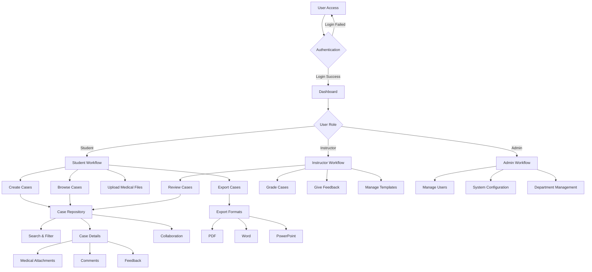
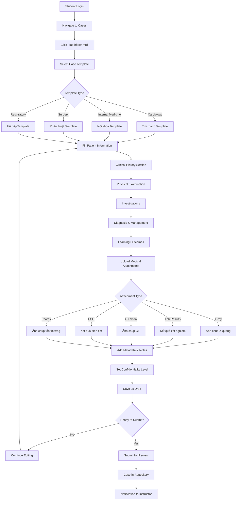
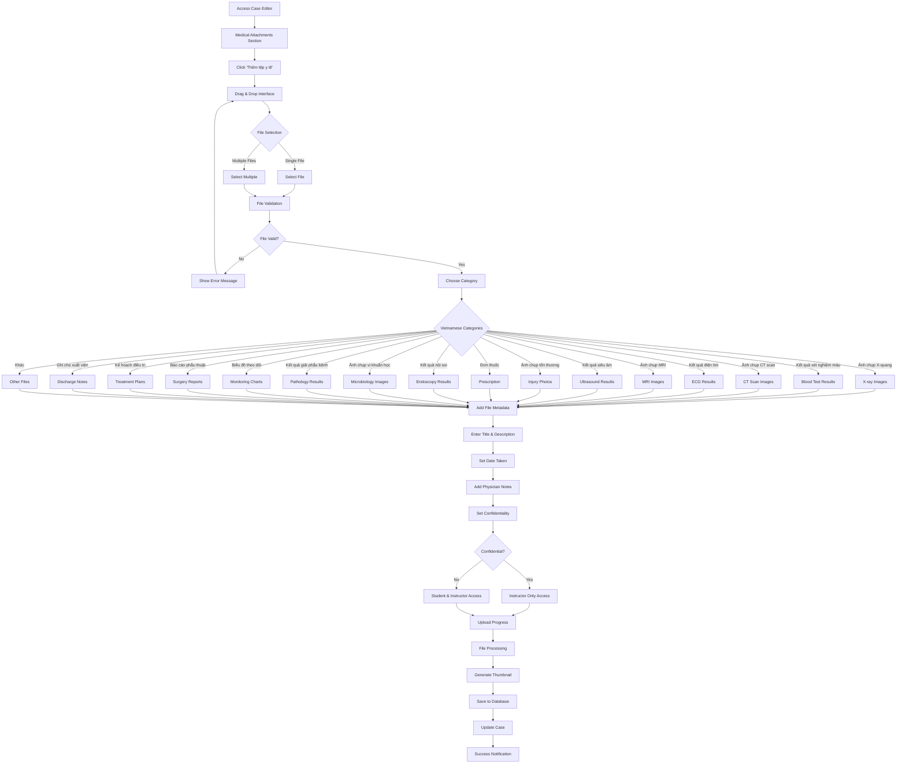
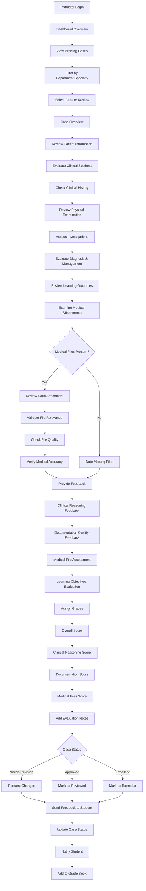
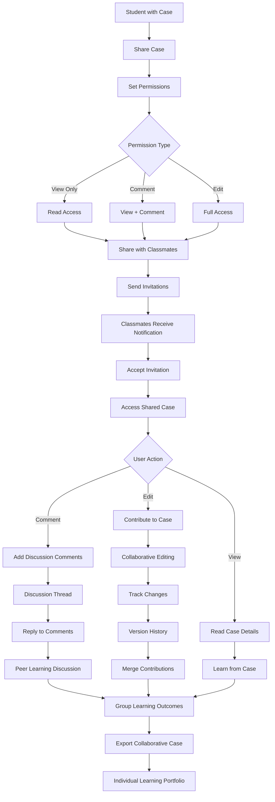
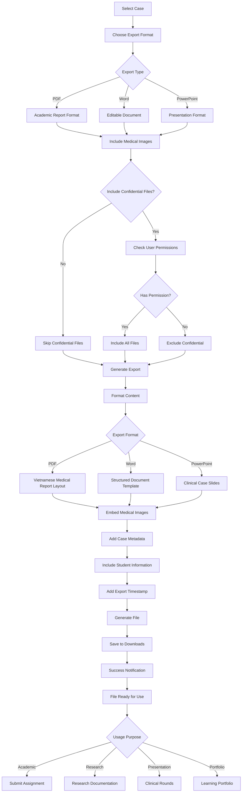
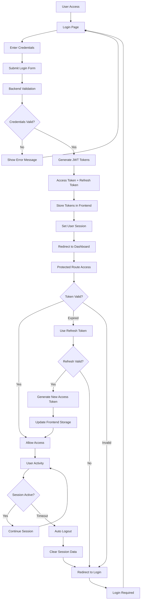
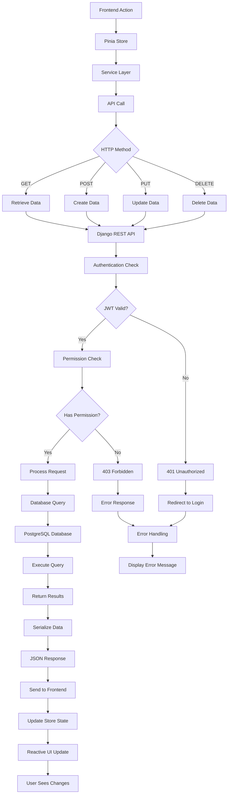

# Clinical Case Management Platform - Workflow Diagrams

## 1. Overall System Workflow

## 2. Student Case Creation Workflow

## 3. Medical File Upload Workflow

## 4. Instructor Review & Grading Workflow

## 5. Collaborative Learning Workflow

## 6. Case Export & Presentation Workflow

## 7. System Authentication & Session Management

## 8. Database & API Interaction Flow

This comprehensive workflow documentation covers all major user interactions and system processes in your Vietnamese Clinical Case Management Platform. Each diagram shows the complete flow from user action to system response, making it easy to understand how the platform operates.